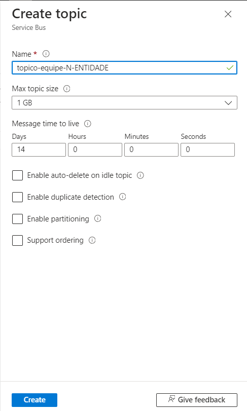
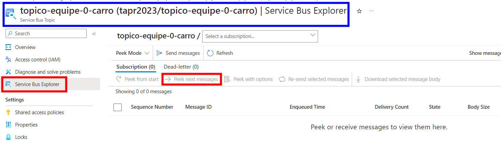

# tapr-2023-equipe1-carro-dotnet


- [Diagrama](diagramas/tapr-microsservico2023.vsdx)

## Autenticação no AZURE
[DOC](https://learn.microsoft.com/en-us/cli/azure/install-azure-cli-linux?pivots=apt)

```
az login -u walter.s@univille.br
az login --use-device-code
az ad signed-in-user show
```

## Extensões do VSCode
[C# Dev Kit](https://marketplace.visualstudio.com/items?itemName=ms-dotnettools.csdevkit)
[Rest Client](https://marketplace.visualstudio.com/items?itemName=humao.rest-client)

## Criação do projeto
```
dotnet new webapi
dotnet dev-certs https --trust
```

## Executar o projeto
```
dotnet watch --launch-profile https
```

## Dependências
```
dotnet add package Azure.Identity
dotnet add package Microsoft.EntityFrameworkCore.Cosmos
```

## CosmosDB
- [Introdução](https://learn.microsoft.com/en-us/azure/cosmos-db/introduction)
- [Databases, containers, and items](https://learn.microsoft.com/en-us/azure/cosmos-db/resource-model)


### Configuração RBAC de permissão
```
az cosmosdb sql role assignment create --account-name COSMOSDBACCOUNT --resource-group GRUPODERECURSO --role-assignment-id 00000000-0000-0000-0000-000000000002 --role-definition-name "Cosmos DB Built-in Data Contributor" --scope "/" --principal-id GUIDUSUARIOAD
```

### Falha de conexão com o CosmosDB devido bloqueio na rede da UNIVILLE
- Alunos que utilizarem seus notebooks pessoais conectados a rede UNIVILLE devem alterar o arquivo RepositoryDBContext.cs para modificar o método de conexão da aplicação com o CosmosDB
- [CosmosDB Gateway Connection](https://learn.microsoft.com/en-us/azure/cosmos-db/dedicated-gateway)
```
protected override void OnConfiguring(DbContextOptionsBuilder optionsBuilder)
{
    optionsBuilder.UseCosmos(
        accountEndpoint: _configuration["CosmosDBURL"],
        tokenCredential: new DefaultAzureCredential(),
        databaseName: _configuration["CosmosDBDBName"],
        options => { options.ConnectionMode(ConnectionMode.Gateway); });
}
```

## CRUD API REST
### Verbo GET
- Objetivo: Retornar uma lista de objetos ou um objeto específico a partir da chave

#### ICarroService.cs
- Criar os métodos na interface do serviço
```
public interface ICarroService
{
    Task<List<Carro>> GetAllAsync();
    Task<Carro> GetByIdAsync(string id);
}
```
#### CarroService.cs
- Implementar a lógica de consulta na classe concreta do serviço
```
public async Task<List<Carro>> GetAllAsync()
{
    var listaCarros = await _dbContext.Carros.ToListAsync();
    return listaCarros;
}

public async Task<Carro> GetByIdAsync(string id)
{
    var carro = await _dbContext.Carros.Where(c => c.id.Equals(new Guid(id))).FirstOrDefaultAsync();
    return carro;
    
}
```
#### teste.rest
- Implementação do teste do verbo GET
```
### Buscar todos os carros
GET http://localhost:5202/api/v1/carro

### Buscar carro pelo ID
GET http://localhost:5202/api/v1/carro/3f840c63-130c-436b-8543-97ab14caf16f
```
### Verbo POST
- Objetivo: Inserir uma nova instância da entidade no banco de dados
#### ICarroService.cs
- Criar o método saveNew na interface de serviço
```
public interface ICarroService
{
    Task<List<Carro>> GetAllAsync();
    Task<Carro> GetByIdAsync(string id);
    Task<Carro> saveNewAsync(Carro carro);
}
```
#### CarroService.cs
- Implementar a lógica para salvar a nova entidade no banco, o campo ID é alterado para null para garantir que o método será utilizado apenas para incluir novos registros
```
public async Task<Carro> saveNewAsync(Carro carro)
{
    carro.id = Guid.Empty;
    await _dbContext.Carros.AddAsync(carro);
    await _dbContext.SaveChangesAsync();

    return carro;
}
```
#### CarroController.cs
- Implememntar no controlador o metodo para inserir o novo carro no sistema.
```
[HttpPost()]
public async Task<IResult> InsertNew(Carro carro){      
    if(carro == null){
        return Results.BadRequest();
    }
    await _service.saveNewAsync(carro);

    return Results.Ok(carro);
}
```
#### teste.rest
- Implementação do teste do verbo POST
```
### Inserir um novo Carro
POST http://localhost:5202/api/v1/carro
Content-Type: application/json

{
  "placa": "MAS1334"
}
```
### Verbo PUT
- Objetivo: Alterar os dados de uma determinada instância da entidade

#### ICarroService.cs
- Criar o método update na interface de serviço
```
public interface ICarroService
{
    Task<List<Carro>> GetAllAsync();
    Task<Carro> GetByIdAsync(string id);
    Task<Carro> saveNewAsync(Carro carro);
    Task<Carro> updateAsync(String id, Carro carro);
}
```
#### CarroService.cs
- Implementar a lógica para realizar o update da entidade no banco
```
public async Task<Carro> updateAsync(string id, Carro carro)
{
    var carroAntigo = await _dbContext.Carros.Where(c => c.id.Equals(new Guid(id))).FirstOrDefaultAsync();        
    if (carroAntigo != null){
        //Atualizar cada atributo do objeto antigo 
        carroAntigo.modelo = carro.modelo;
        await _dbContext.SaveChangesAsync();
    }
    return carroAntigo;
}
```
#### CarroController.cs
- Implememntar no controlador o metodo para realizar o update do registro
```
[HttpPut("{id}")]
public async Task<IResult> Update(string id, Carro carro){      
    if(carro == null || id.Equals(String.Empty))
    {
        return Results.BadRequest();
    }

    carro = await _service.updateAsync(id, carro);

    if(carro == null)
    { 
        return Results.NotFound();
    }

    return Results.Ok(carro);
}
```
#### teste.rest
```
### Atualizar o  Carro
PUT http://localhost:5202/api/v1/carro/be122a6f-885d-4b2d-a3e1-63aa0485c8bb
Content-Type: application/json

{
  "placa": "MAS1334",
  "modelo": "Fiat UNO"
}
```
### Verbo DELETE
- Objetivo: Remover uma instância da entidade

#### ICarroService.cs
- Criar o método delete na interface de serviço
```
public interface ICarroService
{
    Task<List<Carro>> GetAllAsync();
    Task<Carro> GetByIdAsync(string id);
    Task<Carro> saveNewAsync(Carro carro);
    Task<Carro> updateAsync(String id, Carro carro);
    Task<Carro> DeleteAsync(String id);
}
```
#### CarroService.cs
- Implementar a lógica para realizar a exclusão da entidade no banco
```
public async Task<Carro> DeleteAsync(string id)
{
    var carroAntigo = await _dbContext.Carros.Where(c => c.id.Equals(new Guid(id))).FirstOrDefaultAsync();
    if (carroAntigo != null){
            _dbContext.Remove(carroAntigo);
        await _dbContext.SaveChangesAsync();
    }
    return carroAntigo;
}
```
#### CarroController.cs
- Implememntar no controlador o metodo para realizar a exclusão do registro
```
[HttpDelete("{id}")]
public async Task<IResult> Delete(string id){      
    if(id.Equals(String.Empty))
    {
        return Results.BadRequest();
    }

    var carro = await _service.DeleteAsync(id);

    if(carro == null)
    { 
        return Results.NotFound();
    }

    return Results.Ok(carro);
}
```

#### teste.rest
- Implementação do teste do verbo DELETE
```
### Remover o Carro
DELETE  http://localhost:5202/api/v1/carro/be122a6f-885d-4b2d-a3e1-63aa0485c8bb
Content-Type: application/json
```

## Chaves de partição
- [DOC: Particionamento](https://learn.microsoft.com/en-us/azure/cosmos-db/partitioning-overview)
- Correção da classe RepositoryDbContext.cs
```
    protected override void OnModelCreating(ModelBuilder modelBuilder)
    {
        //...
        modelBuilder.Entity<Carro>()
            .HasPartitionKey(o => o.id);
        
    }
```

## Modelagem de bancos de dados NoSQL
- [DOC: Modelagem de dados](https://learn.microsoft.com/en-us/azure/cosmos-db/nosql/modeling-data)

# Azure Service Bus
- [Documentação](https://azure.microsoft.com/pt-br/products/service-bus)
- Passo 1: Criar uma instância do recurso Service Bus, informando o namespace name e o pricing tier Standard (a partir desse SKU há suporte a tópicos)

- Passo 2: Uma vez provisionado, clicar no menu tópicos

- Passo 3: Clicar no link para criar um novo tópico

- Passo 4: Informar o nome do tópico no padrão topico-equipe-<NUMERODASUAEQUIPE>-<NOMEDAENTIDADE>

- Passo 5: Uma vez que o tópico seja provisionado, clicar em subscriptions

- Passo 6: Clicar no link para criar uma nova subscription

- Passo 7: Informar o nome da assinatura no padrão subs-topico-equipe-<NUMERODASUAEQUIPE>-<NOMEDAENTIDADE>

- Passo 8: Clicar no ícone Service Bus Explorer para monitorar as mensagens



# Dapr
- Dapr é um runtime para construção, integração, execução e monitoramento de aplicações distribuídas no formato de microsserviços

- [Building blocks](https://docs.dapr.io/concepts/overview/#microservice-building-blocks-for-cloud-and-edge)

## Instalação
- [Instalação do Dapr CLI](https://docs.dapr.io/getting-started/install-dapr-cli/)

## Inicialização
```
dapr init
```

- Verificando a instalação
```
$ docker ps
CONTAINER ID   IMAGE                COMMAND                  CREATED          STATUS                    PORTS                                                                                                                                     NAMES
f377a492bae6   daprio/dapr:1.12.1   "./placement"            43 seconds ago   Up 42 seconds             0.0.0.0:50005->50005/tcp, :::50005->50005/tcp, 0.0.0.0:58080->8080/tcp, :::58080->8080/tcp, 0.0.0.0:59090->9090/tcp, :::59090->9090/tcp   dapr_placement
a5009c20daa7   redis:6              "docker-entrypoint.s…"   47 seconds ago   Up 44 seconds             0.0.0.0:6379->6379/tcp, :::6379->6379/tcp                                                                                                 dapr_redis
1d669098ac80   openzipkin/zipkin    "start-zipkin"           48 seconds ago   Up 44 seconds (healthy)   9410/tcp, 0.0.0.0:9411->9411/tcp, :::9411->9411/tcp                                                                                       dapr_zipkin
```

## Dependências no POM
- [SDK .NET](https://docs.dapr.io/developing-applications/sdks/dotnet/)
```
dotnet add package Dapr.Client
dotnet add package Dapr.AspNetCore
```
## Componentes Dapr
- Os componentes do Dapr são recursos utilizados pelos microsserviços que são acessados através do sidecar.
- [Dapr Components](https://docs.dapr.io/reference/components-reference/)
- Passo 1: criar uma pasta components
- Passo 2: na pasta components criar o arquivo servicebus-pubsub.yaml

```
# Documentação: https://docs.dapr.io/reference/components-reference/supported-pubsub/setup-azure-servicebus/
apiVersion: dapr.io/v1alpha1
kind: Component
metadata:
  name: servicebus-pubsub
spec:
  type: pubsub.azure.servicebus.topics
  version: v1
  metadata:
  - name: namespaceName
    value: "tapr2023.servicebus.windows.net"
```

- Passo 3.1: na pasta do projeto executar o comando.

```
dotnet build --configuration Release
```

- Passo 3.2: na pasta principal do projeto (mesma pasta do arquivo pom.xml), criar um novo arquivo com o nome dapr.yaml
```
version: 1
common:
  resourcesPath: ./components/
apps:
  - appID: tapr-2023-equipe1-carro-dotnet
    appDirPath: .
    appPort: 5202
    command: ["dotnet", "run", "--configuration","Release"]
```

## Publicação de atualizações da entidade principal do agregado

- Passo 4: alterar o arquivo appsettings.json para incluir dois novos parametros:
  - "AppComponentTopicCarro":"<nome do tópico registrado no service bus>",
  - "AppComponentService":"servicebus-pubsub"

```
#Exemplo
  "AppComponentTopicCarro":"topico-equipe-0-carro",
  "AppComponentService":"servicebus-pubsub"
```

- Passo 5: na classe de serviço da entidade root do agregado, incluir os seguintes códigos:

```
//outros usings...
using Dapr.Client;

public class CarroService : ICarroService
{
    //outros atributos...
    private IConfiguration _configuration;
    private DaprClient _daprClient;
    public CarroService(RepositoryDbContext dbContext,
                        IConfiguration configuration)
    {
        this._dbContext = dbContext;
        this._configuration = configuration;
        this._daprClient = new DaprClientBuilder().Build();
        
    }
    //Método para publicar o novo evento
    private async Task PublishUpdateAsync(Carro carro){
        await this._daprClient.PublishEventAsync(_configuration["AppComponentService"], 
                                                _configuration["AppComponentTopicCarro"], 
                                                carro);
    }
    
    public async Task<Carro> saveNewAsync(Carro carro)
    {
        carro.id = Guid.Empty;
        await _dbContext.Carros.AddAsync(carro);
        await _dbContext.SaveChangesAsync();
        //chamar o método para publicar o evento
        await PublishUpdateAsync(carro);
        return carro;
    }

    public async Task<Carro> updateAsync(string id, Carro carro)
    {
        var carroAntigo = await _dbContext.Carros.Where(c => c.id.Equals(new Guid(id))).FirstOrDefaultAsync();        
        if (carroAntigo != null){
            //Atualizar cada atributo do objeto antigo 
            carroAntigo.modelo = carro.modelo;
            await _dbContext.SaveChangesAsync();
            //chamar o método para publicar o evento
            await PublishUpdateAsync(carroAntigo);
        }
        return carroAntigo;
    }
```

## Executar o teste de publicação de eventos
```
#Executar esse comando dentro da pasta do projeto
dotnet build --configuration Release
dapr run -f .
```
- Passo 6: Usar o arquivo teste.rest para invocar a API REST nos métodos POST e PUT, verificar no Azure Service Bus se os eventos foram publicados no tópico.

## Assinatura das atualizações em um tópico
- Escolher uma das entidades externas aos agregados.

- Passo 1: Criar na classe Controller da entidade externa ao agregado um novo end point chamado Update, que será automaticamente chamado pelo Dapr toda vez que um novo evento for publicado no Service Bus

```
    [Topic(pubsubName:"servicebus-pubsub",name:"topico-equipe-0-cliente")] 
    [HttpPost("/event")]
    public async Task<IResult> UpdateClient(Cliente Cliente){      
        if(Cliente == null){
            return Results.BadRequest();
        }
        Console.WriteLine("EVENT" + Cliente.Nome);
        await _service.updateEventAsync(Cliente);

        return Results.Ok(Cliente);
    }
```
- Passo 3: alterar a classe de serviço da entidade, para incluir um método update recebendo como parâmetro apenas a classe de entidade.

```
public interface IClienteService
{
    Task<List<Cliente>> GetAllAsync();
    Task<Cliente> GetByIdAsync(string id);
    Task<Cliente> saveNewAsync(Cliente cliente);
    Task<Cliente> updateAsync(String id, Cliente cliente);
    Task<Cliente> DeleteAsync(String id);
    Task<Cliente> updateEventAsync(Cliente cliente);
}
```
- Passo 4: incluir na classe de implementação do serviço da entidade, o código do método abaixo para receber a entidade e atualizar no banco de dados local do serviço.

```
    public async Task<Cliente> updateEventAsync(Cliente cliente)
    {
        var clienteAntigo = await _dbContext.Clientes.Where(c => c.id.Equals(cliente.id)).FirstOrDefaultAsync();
        if (clienteAntigo == null){
            await _dbContext.Clientes.AddAsync(cliente);
            await _dbContext.SaveChangesAsync();
        }else{
            await updateAsync(cliente.id.ToString(),cliente);
        }
        return cliente;
    }
```
## Executar o teste de assinatura dos eventos
```
#Executar esse comando dentro da pasta do projeto
dapr run -f .
```
- Mantendo a aplicação em execução, abrir um novo terminal e executar o exemplo do comando abaixo alterando os parametros para simular a publicação de um evento.

```
#Exemplo de publicação de atualização do evento
# dapr publish --publish-app-id <nome da aplicação no arquivo dapr.yaml> --pubsub <nome do componente do service bus no arquivo /componenets/servicebus-pubsub.yaml> --topic <nome do topico registrado no service bus> --data '<objeto JSON contendo os campos da entidade>'

dapr publish --publish-app-id tapr-2023-equipe1-carro-dotnet --pubsub servicebus-pubsub --topic topico-equipe-0-cliente --data '{"id": "536b15ee-e52f-4f06-b22d-51dfe2d18d79","nome": "Zezinho","endereco": "Rua lalala 100"}'
```

- Verificar no banco de dados se a entidade

- IMPORTANTE: caso o número de mensagens na fila de mensagens mortas (Dead-Letter queue), é porque a mensagen enviada no passo anterior tem algum erro de formatação em relação a entidade da aplicação em .net
